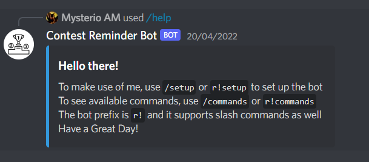
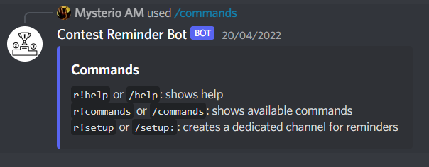
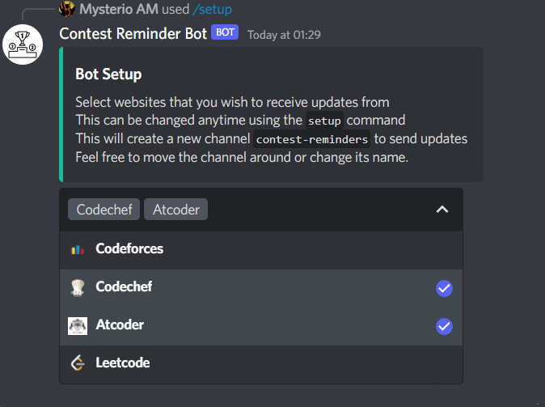

# Contest Reminder Bot

This is a Discord Bot that sends reminders for upcoming contests from [codeforces](codeforces.com), [codechef](codechef.com), [atcoder](atcoder.jp), [leetcode](leetcode.com) so that you need not keep track of that. You can choose yourself which sites to receive updates from. Data is obtained either from APIs or by scraping the web pages.

## TechStack Used:
- [x] nodejs
- [x] discord.js
- [x] MongoDB / mongoose
- [x] axios
- [x] cheerio

## Instructions:

To test the bot for yourself, invite bot with [invite_link](https://discord.com/api/oauth2/authorize?client_id=965978317209620510&permissions=8&scope=bot%20applications.commands) to your server.

## Available Commands:

- #### `/help` or `r!help`

    Shows the help message. The help message is shown by default when the bot joins a new Server.

    

- #### `/commands` or `r!commands`

    Shows available commands.

    

- #### `/setup` or `r!setup`
    Asks which websites to set reminders for. Creates a channel `contest-reminder` to send reminders in that channel. After creation, the channel can be renamed or moved around. If the channel is deleted, or the preferences need to be changed, run `/setup` again.

    

- ## Demo Video:

    https://user-images.githubusercontent.com/98008131/164793404-17c6f954-14bd-496e-8547-66d0781ceba8.mp4
    
